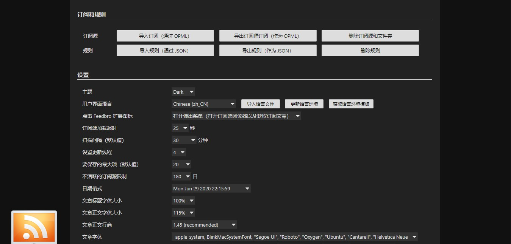

# Feedbro Chinese Language Template

根据官方语言模板修改而成。大部分是机器直接翻译，手动修改了一些明显的翻译故障。

## 使用

在设置页面中，点击`Import Locale`导入配置文件。这里不能直接导入文件，需要在对话框内输入语言文件（JSON格式）的链接地址：

```
https://raw.githubusercontent.com/umm233/Freebro-zh_CN-Template/master/feedbro-locale-zh_CN.json
```

效果图：


